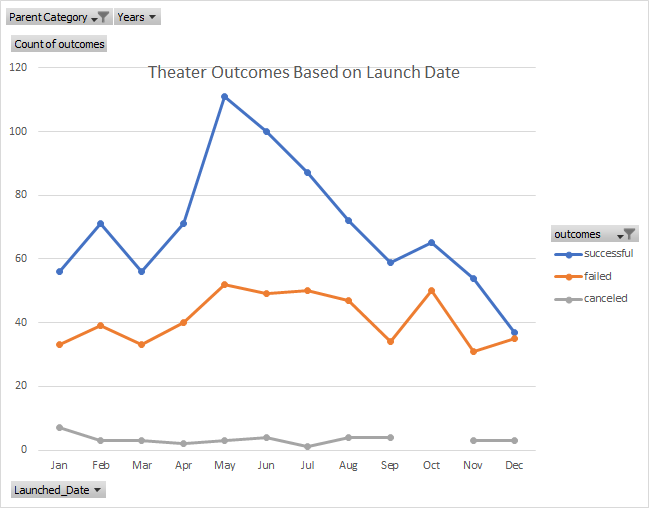
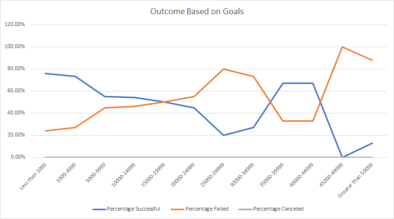

# Kickstartering with Excel

## Overview of Project
Louise wants to know how different campaigns fared in relation to their launch dates and their funding goals.There are 4,014 different campaing between _2009_ to _2017_ took place throughout the world . The purpose is to find out what makes a campaign project _Successful_ or _Failed_. We are going to visualize _Theater_ campaign which has three subcatagories based on its lauch dates and funding goals to deliver the outcome to Louise and help her within her choice of  setting her campaing budget, campaing goal and launch date of her _play_ campaign to make it successful. Her campaign budget is estimated about 10,000 $ so we need to focus on around her estimation. 
## Analysis and Challenges

### Analysis of Outcome based on Launch Date
The outcome based on launch date as is displayed below, shows that out of _1,369_ campaings in _Theather_ category and _Play_ subcatagory _839_ campaings were _Successful_ which is _61%_ of all and _493_ campaings have _Failed_ which comes to _36%_. Between March to May the campaign outcomes increased and it peaked on May by _111_ and reached to 100 on June and it dropped afterwards till end ot the year. The outcomes flactuated from Jan to March around 60. On Dec the outcomes of _Successful_ and _Failed_ met at around _35_. The month that launched the most successful Kickstarter campaigns was May. However, January, June, July and October all had roughly the same number of failed campaigns launched.

 
###Challenges or Difficulties Encountered

There's a column in the worksheet named "Category and Subcategory," which groups a main category with all of its subcategories for instance _Theater_ has three subcatagories of _Plays_, _Musical_ and _Spaces_. We made our data more detailed by splitting the Category and Subcategory column into two distinct columns: "Parent category" and "Subcategory." This gives us additional data to use in our analysis.

### Analysis of Outcome based on Goals
The most _successful_ campaings are in the groups of _[Less than 1000]_ and _[1000-4999]_ which have more then _70%_of success and the bigest rate of failed belongs to _[45000-49999]_ and _[Greater than 50000]_ wich is almost 90% to 100%. The Line chart shows that by  

 

## Results
## What are two conclusions you can draw about the Theater Outcomes by Launch Date? 
1)
## What can you conclude about the Outcomes based on Goals?

What are some limitations of this dataset?

What are some other possible tables and/or graphs that we could create?
